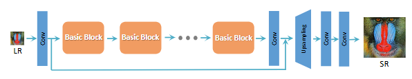
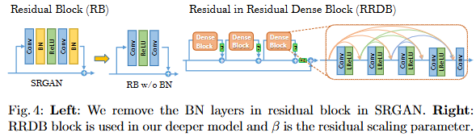
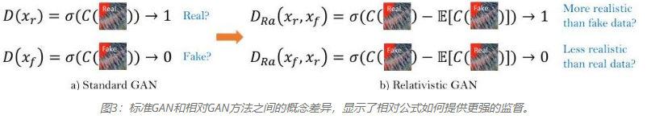
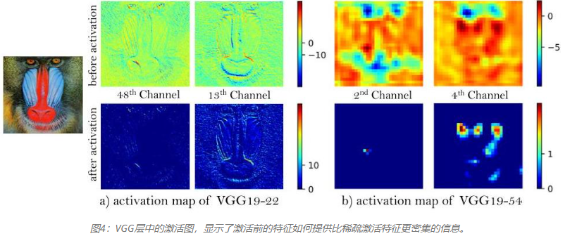

论文：ESRGAN: Enhanced Super-Resolution Generative Adversarial Networks

# 网络结构

RRDBNet 网络结构整体类似VGG样式。

| 层级   | 组件            | 输入→输出通道 | 说明                                           |
| ---- | ------------- | ------- | -------------------------------------------- |
| 1    | `conv_first`  | 3 → 64  | 浅层特征提取                                       |
| 2~24 | `RRDB × 23`   | 64 → 64 | 核心深层特征处理，每个 RRDB 内含 5 层密集连接 + 残差缩放 (×0.2)    |
| 25   | `conv_body`   | 64 → 64 | 后处理卷积                                        |
| 26   | `Trunk Skip`  | -       | `conv_first` 与 `conv_body` 输出相加（长跳跃连接，逐元素相加） |
| 27   | `Upsample ×2` | 64 → 64 | 每次：Conv 64→256 + PixelShuffle 还原 64 图像宽高翻倍   |
| 28   | `conv_last`   | 64 → 3  | 重建输出 RGB                                     |

RRDB 块如下图所示，其特点([[../nn积木/RRDB|RRDB]])：
1. 移除批量归一化（BN）层：作者观察到BN层在基于GAN的训练中**引入伪影**并**限制泛化能力**。移除这些层可使训练更稳定，性能更一致，同时减少计算开销。为了在没有BN层的情况下促进深度网络的稳定训练，采用了两种技术：
  - **残差缩放**：残差在添加到主路径之前按一定因子（通常为0.2）进行缩放。
  - **更小的初始化**：参数以比标准方法更小的方差进行初始化。
2. 残差内残差密集块（RRDB）：这个新的构建块取代了标准残差块，并在多级残差结构中包含了密集连接。每个层都连接到所有前面的层，从而实现特征重用并增加网络容量。

# 相对鉴别器

ESRGAN用相对平均鉴别器（RaD）取代了标准鉴别器，该鉴别器预测真实图像和伪造图像之间的相对真实性，而不是绝对概率。鉴别器损失变为：
$$
L_{Ra}^D = -\mathbb{E}_{x_r}[\log(\sigma(D_{Ra}(x_r, x_f)))] - \mathbb{E}_{x_f}[\log(1 - \sigma(D_{Ra}(x_f, x_r)))]
$$
其中 $D_{Ra}(x_r, x_f) = D(x_r) - \mathbb{E}_{x_f}[D(x_f)]$。

# 感知损失改进

感知损失通过使用VGG网络中在激活层之前而不是在激活层之后提取的特征来增强：：
$$
L_{percep} = \frac{1}{W_{i,j}H_{i,j}} \sum_{x=1}^{W_{i,j}} \sum_{y=1}^{H_{i,j}} (\phi_{i,j}(I^{HR})_{x,y} - \phi_{i,j}(G(I^{LR}))_{x,y})^2
$$
其中 $\phi_{i,j}$ 代表VGG网络中激活前的特征。

为了平衡感知质量和保真度，ESRGAN引入了一种网络插值技术：
$$
G_{interp} = (1-\alpha) \cdot G_{PSNR} + \alpha \cdot G_{GAN}
$$
其中 $\alpha \in [0,1]$ 控制着PSNR导向的结果（模糊但准确）与基于GAN的结果（锐利但可能包含伪影）之间的权衡。