# 成像系统基本结构

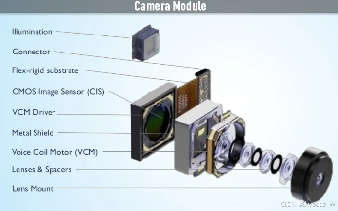

# Sensor 组成

| 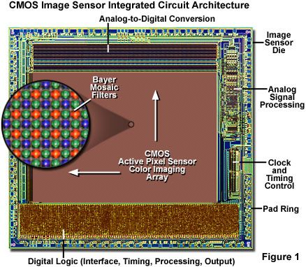 | 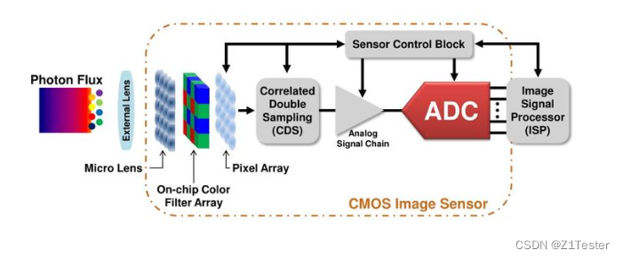 |
| ----------------------------- | ----------------------------- |

# Pixel 组成

| Pixel 结构图 | 4T Pixel 说明 |
| --- | --- |
| 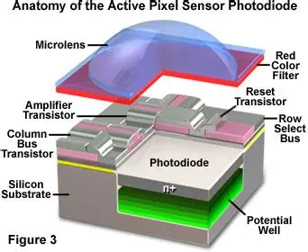 | 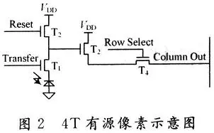  1. 传输管 (Transfer Gate, TG) 2. 复位管 (Reset Gate, RST) 3. 源极跟随器 (Source Follower, SF) 4. 行选择管 (Row Select, RS 或 SEL)  - 复位阶段：RST打开，将FD复位至VDD，然后RST关闭。 - 读取复位电平（V_reset）：通过SF和RS读出此时FD的电压。这个值包含了复位噪声和固定模式噪声。 - 转移阶段：TG打开，将PD中的电荷全部转移到FD。 - 读取信号电平（V_signal）：再次通过SF和RS读出此时FD的电压。这个值是信号电压 + 复位噪声 + 固定模式噪声。 - 相关双采样（CDS）：信号电平 - 复位电平 = 纯净的信号电压。通过这个减法，抵消复位噪声和大部分固定模式噪声。 |

### 相关术语

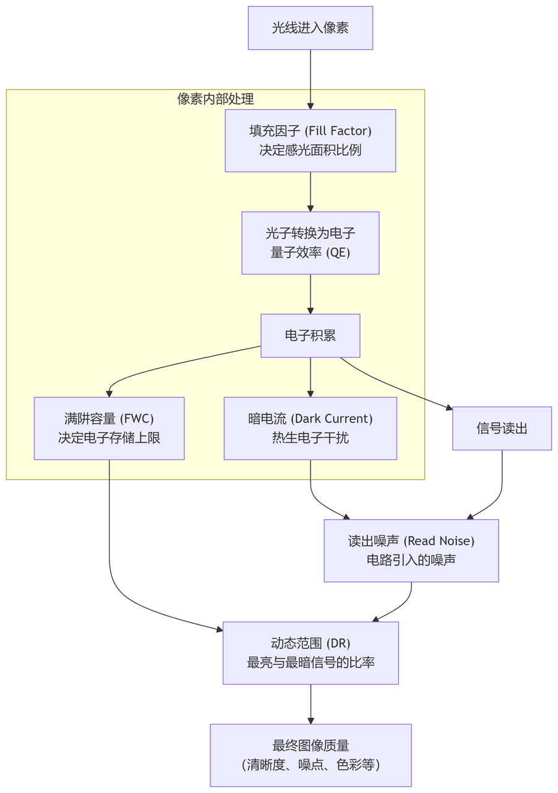

# ISP

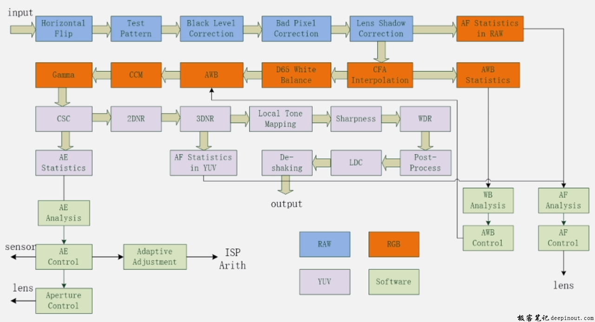

## BLC BPC DPC

| **术语**  | **全称**                     | **中文** | **解决什么问题？**                           | **工作原理**           | **特点**        |
| ------- | -------------------------- | ------ | ------------------------------------- | ------------------ | ------------- |
| **BLC** | Black Level Correction     | 黑电平校正  | 整体基底信号偏移                              | 减去光学黑区测量的固定值       | 全局性校正，影响整个画面  |
| **BPC** | Bad Pixel Correction       | 坏点校正   | 静态的、固定的坏点 dark pixel 、 hot pixel | 根据预存的坏点表查找并替换      | 离线、固定列表       |
| **DPC** | Defective Pixel Correction | 缺陷像素校正 | 动态的、随机的坏点                             | 通过实时算法检测并替换（如中值滤波） | 在线、实时计算  |

## FPN(C)  LSC

| FPNC (sensor)                 | LSC （sensor+lens） mesh/radius |
| ----------------------------- | ----------------------------- |
| 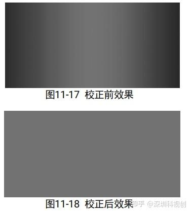 | 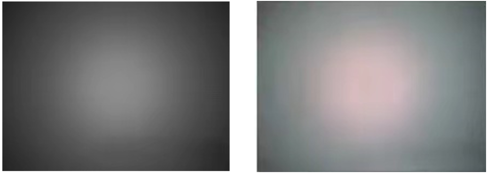 |

### **Luma shading**

| Lens 引起                       | microlens                     | FSI/BSI                        |
| ----------------------------- | ----------------------------- | ------------------------------ |
| 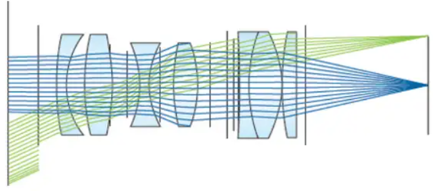 | 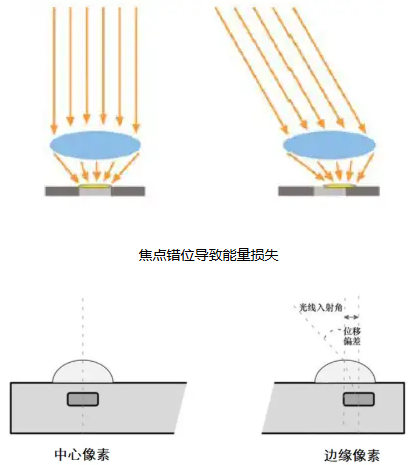 | 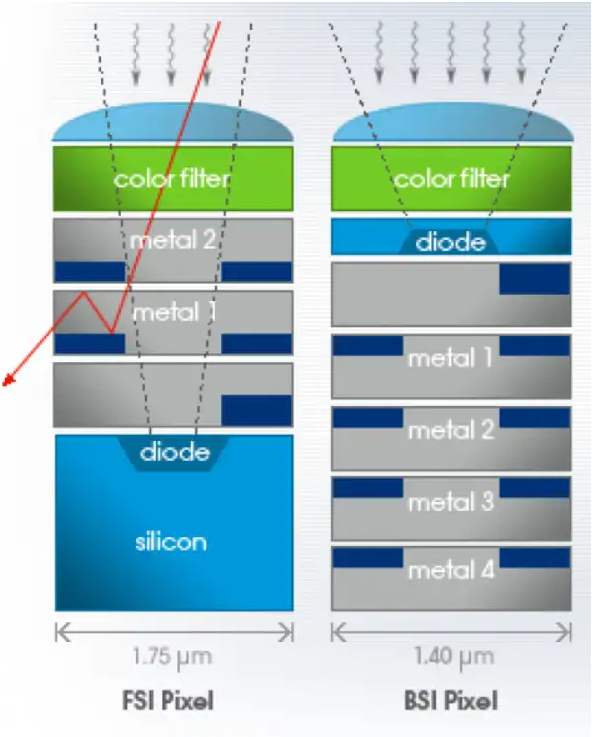 |

CRA （Chief Ray Angle）

| Lens CRA                       | Sensor CRA                     |
| ------------------------------ | ------------------------------ |
| 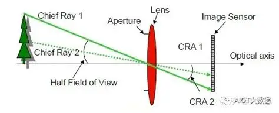 | 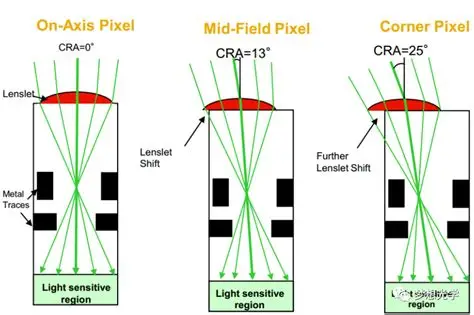 |

### **Chroma shading**

| 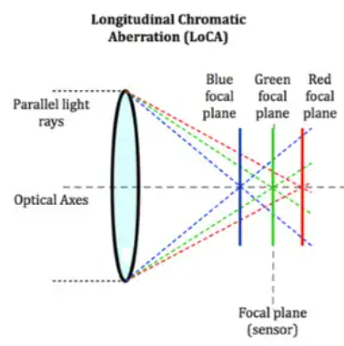 | 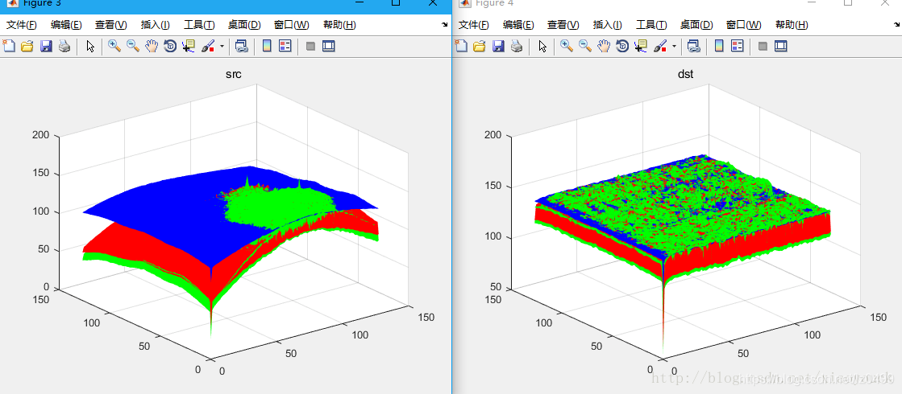 |
| ------------------------------ | ------------------------------ |

## AWB / GB:

在不同光源下，自动校正图像的颜色，使白色物体看起来依然是白色(人类视觉的恒常性)。

AWB基本原理：

1、标定各个色温下 Rgain Bgain (color checker/灰卡 + 标准光源箱)

2、拍摄时色温估计（灰度世界法、灰边法、完美反射法、场景估计等、nn估计）

3、矫正通道增益

GB：Gr Gb 表现不一致（工艺问题、crosstalk）

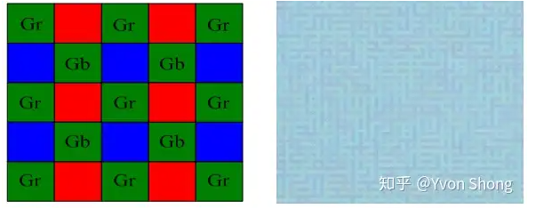

## CCM / CA / Gamma / 3D lut / CSC

| CCM（Color Correction Matrix）                                      | gamma                          | CA（chroma aberration）                                        | **3D lut**                                                   |
| ----------------------------------------------------------------- | ------------------------------ | ------------------------------------------------------------ | ------------------------------------------------------------ |
| 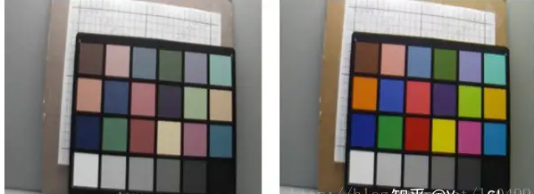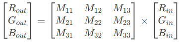注意灰平衡 | 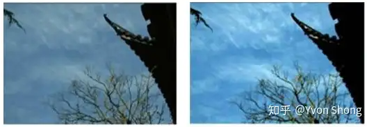 | 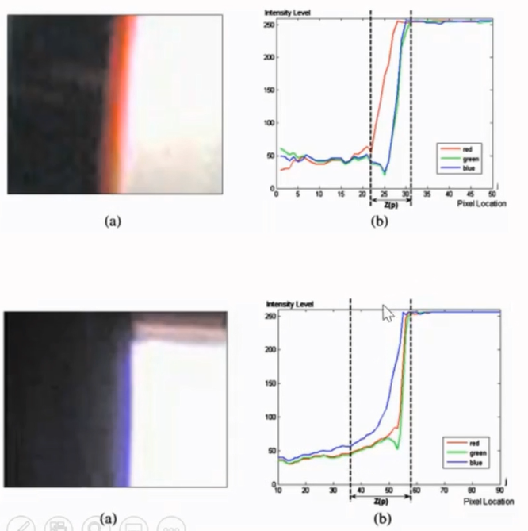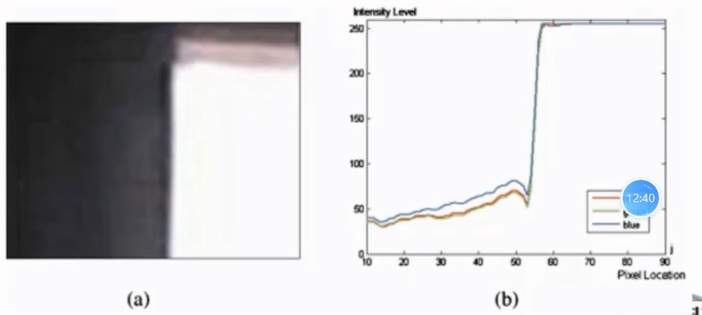 | 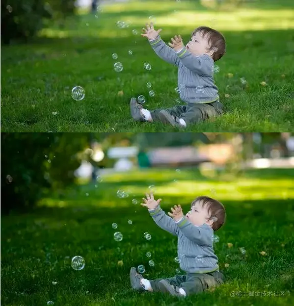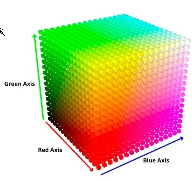 |

### CA 的原因

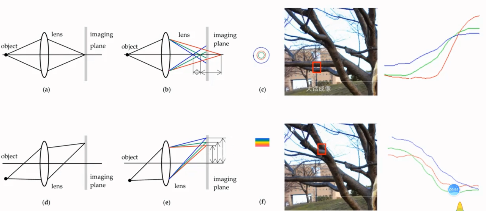

### CSC (color space conversion)  RGB->YUV

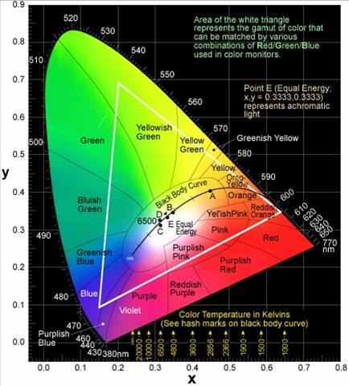

## Denoise

Sensor 噪声的来源：

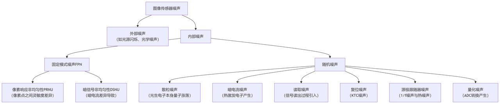

| **噪声类型**    | **是否与信号相关？** | **是否固定？** | **主要影响因素**     | **可否通过校准消除？** |
| ----------- | ------------ | --------- | -------------- | ------------- |
| **光子散粒噪声**  | **是**        | 随机   | 光照强度           | 否             |
| **PRNU**    | 是            | **固定**    | 制造工艺           | **是**         |
| **DSNU**    | 否            | **固定**    | 温度、曝光时间        | **是**         |
| **暗电流散粒噪声** | 否            | 随机        | 温度、曝光时间        | 否             |
| **读取噪声**    | 否            | 随机        | 温度、读出电路设计、读出速度 | 否（CDS可消复位噪声）  |
| **量化噪声**    | 是            | 随机        | ADC位深          | 否             |

* 在低光照（低信号）条件下，读取噪声是主导，它决定了图像的暗部是否干净。

* 在正常或高光照条件下，光子散粒噪声是主导，因为它随着信号增大而增大。

* 在长曝光或高温环境下，暗电流噪声会成为主要噪声源。

RAW域降噪（噪声最纯净、避免色彩伪影、提升去马赛克质量）:

噪声特征：散粒噪声+高斯噪声

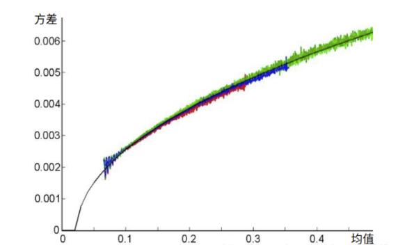

常见流程：raw->pixel shuffle-> vst-> denoise-> ivst -> pixel unshuffle

2DNR: 单帧图像降噪 双边滤波、NLM、BM3D

3DNR: 运动估计、运动补偿、时域融合

彩噪：对Cb Cr通道降噪

## sharpen

高频信息提取（多尺度、方向、降噪模块联动、肤色保护）+ 细节增强

## TMO(tnoe mapping operator)

16bit image -> 直方图统计（全图GTM、分块LTM）->计算lut(融合、限幅)->应用图像->8bit 图像

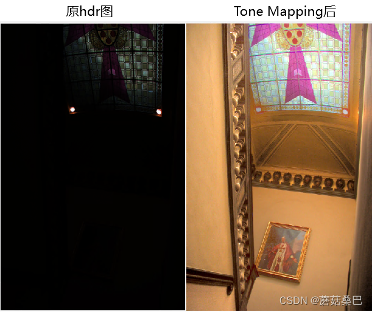

## HDR

大小像素、长短行（通常双增益）、长短帧
参考 [[../sensor/2025 HDR Sensor Survey|2025 HDR Sensor Survey]]

## LDC

镜头畸变矫正

| 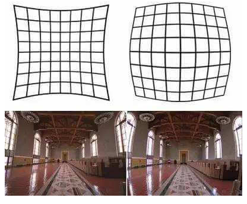 | 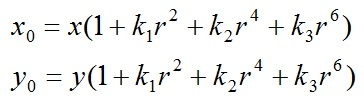 |
| ------------------------------ | ------------------------------ |

## AEC

测光

| 策略     | 原理          | 场景       |
| ------ | ----------- | -------- |
| 全图平均测光 | 全图统计亮度      | 风光摄影     |
| 中心加权测光 | 全图但优先保证中心区域 | 人像等      |
| 点测光    | 小区域测光       | 月亮       |
| 矩阵测光   | 场景识别+矩阵加权   | 最常用（如手机） |

AE需要考虑的问题:

场景识别（人脸优先、雪景、夜景）

抗频闪

运动模糊、噪声

AE loop

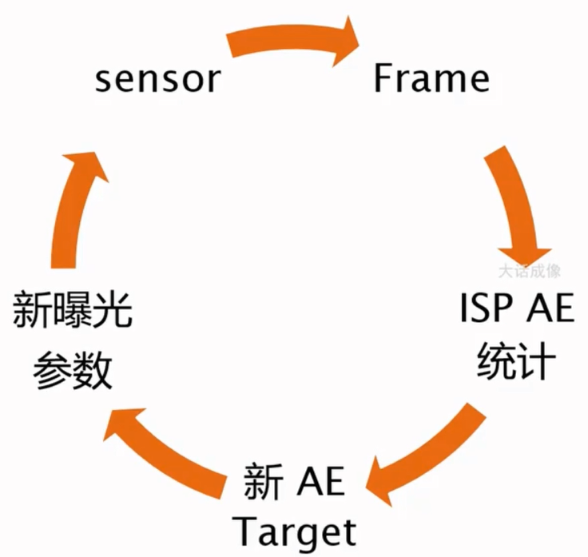

# 如何衡量ISP效果的好坏

## MTF （sharpen denoise）

| USAF1951                       | ISO12233                       | SFR                                                          |
| ------------------------------ | ------------------------------ | ------------------------------------------------------------ |
| 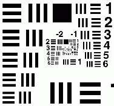 | 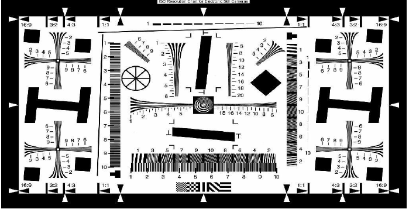 | 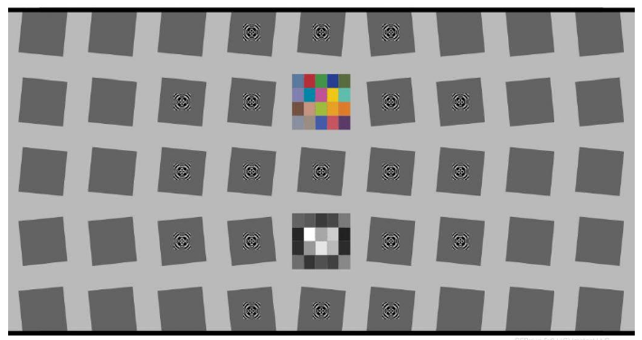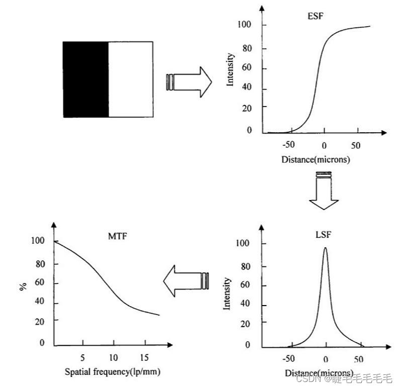 |

## 锐化

适当锐化能够提升MTF,但过度锐化会造成图像质量下降

| 锐化过度                           | 落币图                            | https://www.imatest.com/docs/texture-examples/#cameraphone8mpxl |
| ------------------------------ | ------------------------------ | --------------------------------------------------------------- |
| 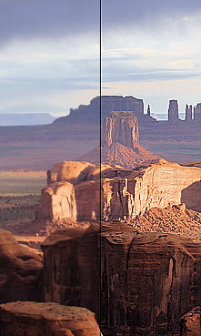 | 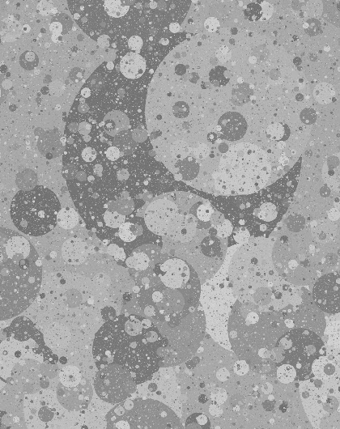 | 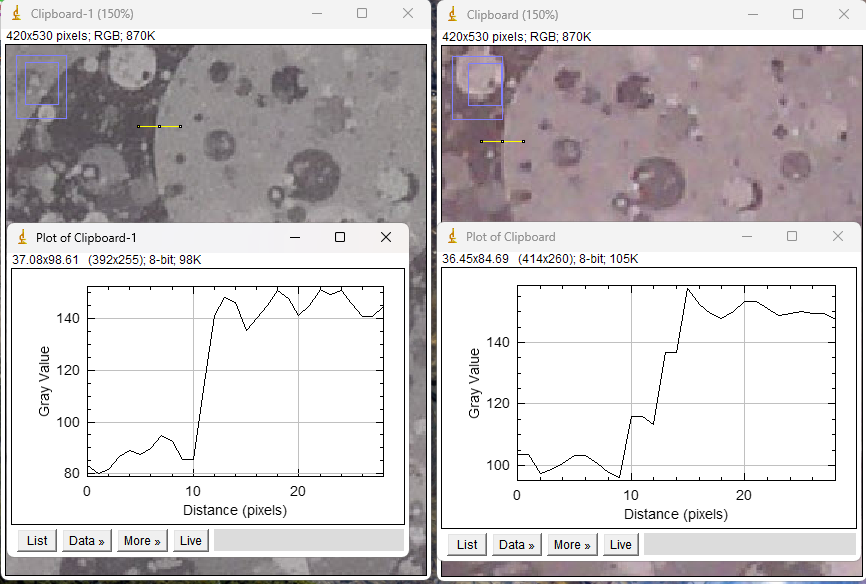                                  |

## 噪声

1、Fixed Pattern Noise (FPN，固定模式噪声)：采集暗场或均匀亮场图像

2、时域噪声（ISO15739）:双图差分法

* 操作：拍摄两张完全相同的测试图图像（`I1`和`I2`），计算它们的差值图像 `D = I1 - I2`。

* 核心原理：

  1. 消除FPN：由于FPN在两幅图像中是固定不变的，相减时会被完美抵消。`FPN - FPN = 0`。

  2. 噪声功率叠加： Temporal Noise是随机且不相关的。两个不相关的随机信号相减，其方差（功率）是相加的。

     * 设每张图像的总噪声为 `σ_total`，其中包含 Temporal Noise `σ_t` 和 FPN `σ_f`。

     * 差值图像D的方差为：`Var(D) = Var(I1 - I2) = Var(I1) + Var(I2) = 2 * (σ_t² + σ_f²)`

     * 但是，因为FPN已被抵消，差值图像D中实际只包含来自两张图的 Temporal Noise，所以D的标准差实际上是 `σ_d = √(σ_t1² + σ_t2²)`。假设两次噪声水平相同（`σ_t1 = σ_t2 = σ_t`），则 `σ_d = √(2 * σ_t²) = √2 * σ_t`。

* 计算公式：
  `σ_t = std(D) / √2`
  其中 `std(D)` 是差值图像 `D` 所有像素值的标准差。

## 色差 / AWB （CCM 等）

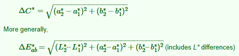

## DR (TMO gamma HDR AE)

| 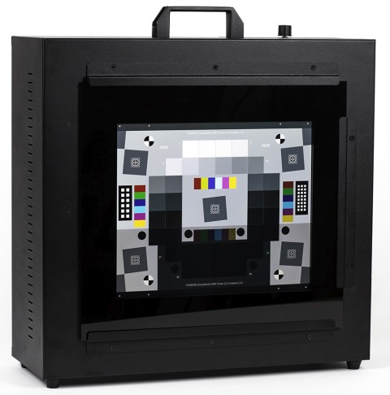 | 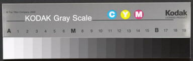 |
| ------------------------------ | ------------------------------ |

目标：1、各个灰阶的step能分开，2、灰阶的顺序变化是合理的

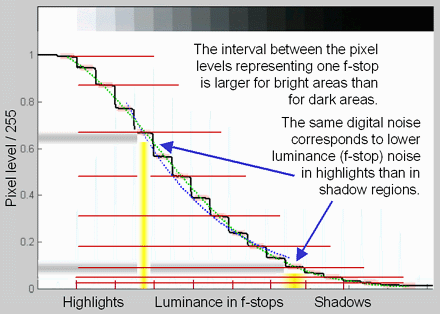

## 其他

| 平场  | 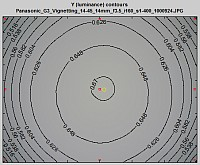                               |
| --- | ------------------------------------------------------------ |
| 紫边  | 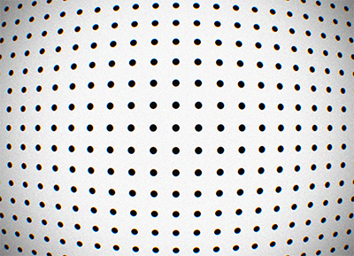                               |
| 畸变  | 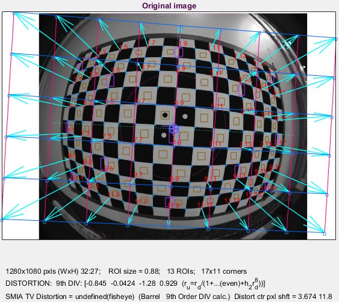                               |
| 摩尔纹 | 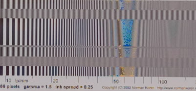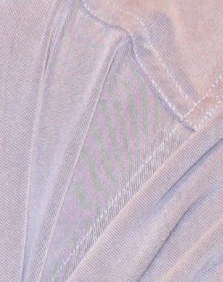 |

