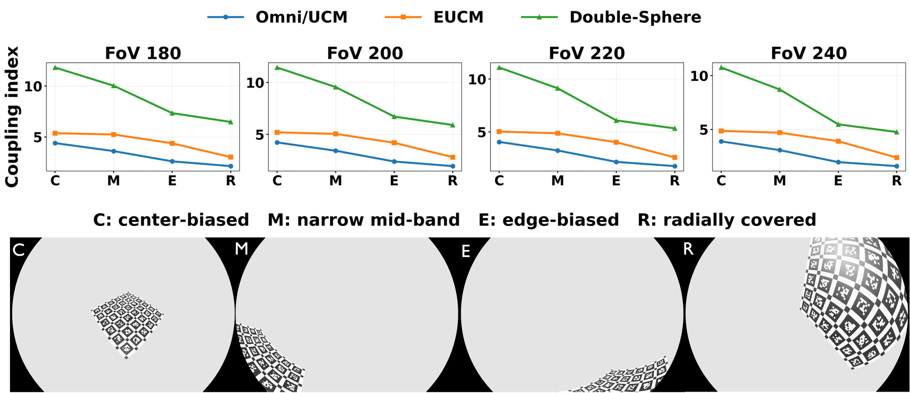

原文：Observation Quality Matters: Robust Multi-Fisheye Calibration via Failure-Oriented Analysis

本文对工业上司空见惯的做法（标定板斜着放，提点覆盖全等）做了严谨的问题分析，找到了经验背后的原理，值得一看。

本文分析了多鱼眼系统中，标定**不稳定**的原因。本文指出：
1. 边缘畸变大，造成提点困难只会影响成功率，不会引起不稳定（本文提出NN提点改进）
2. **核心问题**：初始化质量不好，点没有从中心到边缘全覆盖（本文提出帧筛选器来选择好帧）

**本文发现**：焦距跟畸变两个不同的参数存在耦合。如果点只覆盖中心，或者只有边缘，优化器就会困惑（焦距、畸变耦合）。对与Kalibr为主的优化器依赖初始值，一旦初始值异常，后续优化都会偏。
下图显示管使用什么鱼眼模型(Omni/UCM，EUCM,Double-Sphere)，都是径向分布好的，即焦距跟畸变参数耦合最小(图中R状态)

**什么算好**：
1. 径像跨度大（解耦焦距与畸变）
2. 投影各向同性（缩放程度均匀，避免中间畸变小，边缘压缩厉害。标定板相对鱼眼斜着放，不要正对也不要太斜）
3. 多相机同时都能看到
4. 单目填充，补全未覆盖区域
