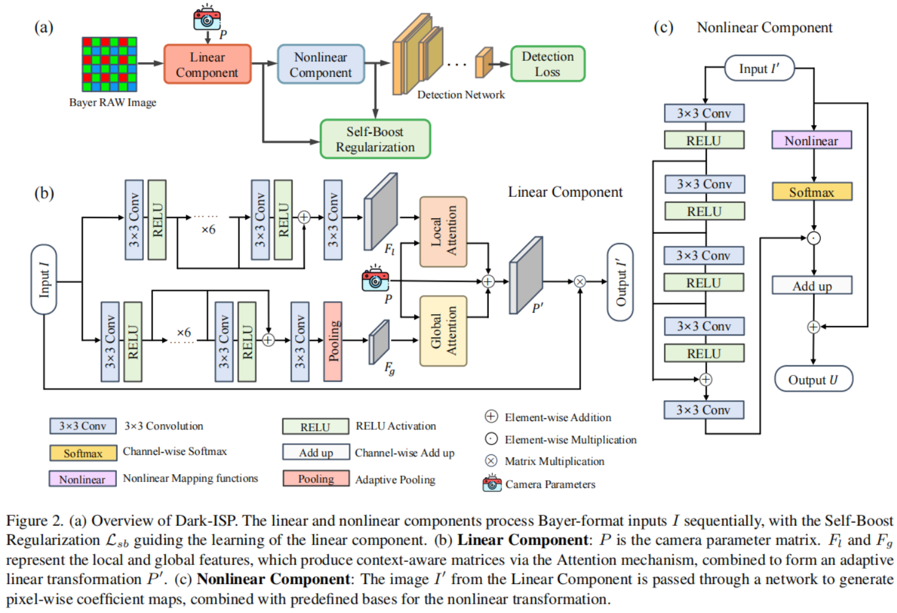
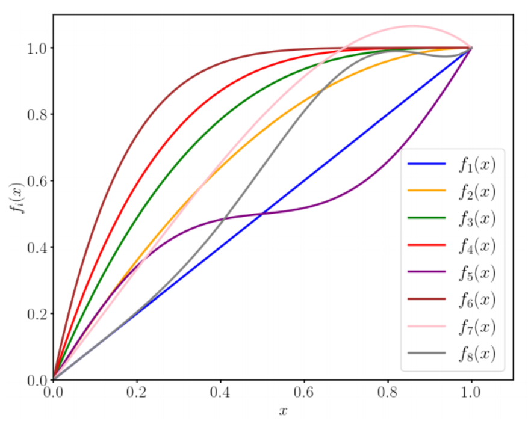

原文：Dark-ISP: Enhancing RAW Image Processing for Low-Light Object Detection

本文主要是针对 暗光场景 object-detection 任务设计了一个轻量化ISP，主要有以下特点：
1. 网络参考ISP 分为线性部分/非线性部分，可解释性强
2. 训练直接带上 检测网络（适应检测网络需求）
3. 两个网络同步训练，通过 "Self-Boost Regularization" 解决两级网络难训练问题

# 网络结构

下图(a) 可以看到网络分为了 Linear Nonlinear 两部分

## Linear 部分

Linear 部分模拟了传统ISP的线性部分，主要包括：
- 白平衡（W）：乘一个对角矩阵，调色温
- 去马赛克/合并（B）：把4通道（RGGB）合并成3通道（RGB）
- 色彩空间变换（C）：乘一个色彩校正矩阵，把颜色调准

这些操作可以用一个线性变换矩阵$P$(大小为3* 4)来实现，即
$$
I'=P \cdot I
$$
这里矩阵$P$是初始输入，网络有两路注意力（全局，关注整体颜色；局部：关注局部区域颜色），得到$P_g$ 跟 $P_l$，随后残差链接得到最终的变换矩阵：
$$
P'=P+P_g+P_l
$$
为了线性变换，线性网络的输出为：
$$
I'=P' \cdot I
$$

## Nonlinear 部分

非线性部分主要处理亮度，预测不同的变换曲线来拉伸
本文非线性部分的思想跟很多可解释性ISP类似，但实现起来不相同。本文借鉴泰勒级数的思想，将拉伸曲线分解为8阶曲线的加权和，即
$$
F(x_{ij})=\sum_{k=0}^{n}C_k(i,j)f_k(x_{ij})
$$
网络预测$C_k(ij)$
本文选用的曲线基函数如下：

另外，Nonlinear 后接了一个 softmax，目的是确保 1. 避免数值溢出，2. 遵守ISP"能量守恒"

# Self-Boost Regularzation

这个操作是为了解决两阶段网络训练不同步问题，其他工作一般都是分阶段训练（训练一个，冻结另一个）。不过本文的网络没有**真值图像**，Loss 是 检测网络传递过来的，因此无法使用分阶段训练。

**问题**
1. 非线性网络离Loss 更近，共容易收敛；线性网络会更难收敛
2. Loss 传导到线性网络的路径太长，因此线性网络更难收敛
3. 线性网络部分收敛慢，给非线性的输入较差，会造成非线性网络摆烂

**解决办法**
1. 反向传播是给线性网络构造一个 GT 图，即用非线性网络的输出($U$)逆变换为他的输入($I'$),用$I'$作为线性网络的GT
2. 线性网络的传播不学习 像素对齐，只对齐方向，余弦相似度：
$$
L_{sb}=\sum||1−cos(p'_i,\tilde{p}_i)||
$$
3. 这个自增强损失要等训练预热（Warmup） N 个 epoch 后才激活（确保构造GT质量不要太差）

