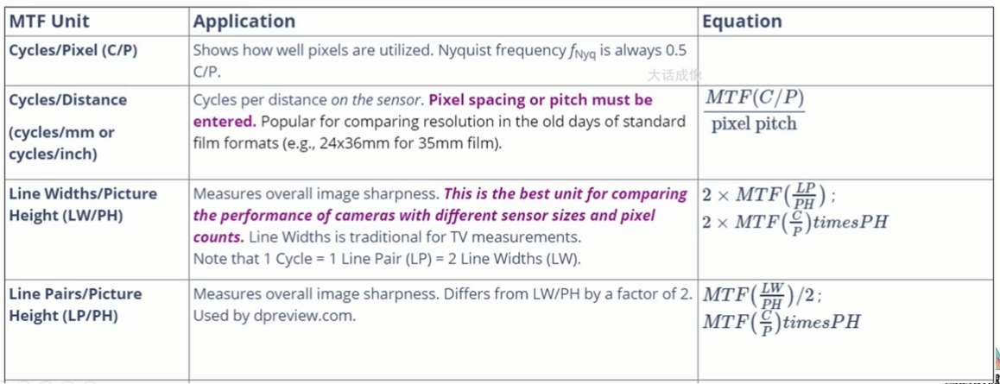

## 基本概念

### 名词解释
![[attachments/2024-01-07-13-38-47-image.png]]
**optical axis** 光轴

**optical center** 光心

**aperture** 光圈

**focal length（*f*）** 焦距

**** 

### 光圈与F数
![[attachments/2024-01-07-13-43-49-image.png]]
**光圈与NA**
![[attachments/2024-01-07-13-44-26-image.png]]
****

**aperture stop 与 field stop**
![[attachments/2024-01-07-13-47-36-image.png]]
**AS** 决定了物方发出光线的直径

**FS** 决定了系统视野大小

****

### 入瞳 出瞳

![[attachments/2024-01-07-13-49-39-image.png]]
**入瞳**从物方向镜头里面看到的光圈的虚像

**出瞳**从像方向镜头里面看到的光圈的实像

****

### 景深

![[attachments/2024-01-07-13-51-39-image.png]]
****

### 视野

![[attachments/2024-01-07-13-52-36-image.png]]
****

### 正透镜与负透镜

![[attachments/2024-01-07-13-53-14-image.png]]
****

**shape factor $\sigma$**

$$
\sigma = \dfrac{R_2+R_1}{R_2-R_1}
$$
![[attachments/2024-01-07-13-58-52-image.png]]

离轴处会早成焦距变化，引发球差
![[attachments/2024-01-07-13-58-31-image.png]]
****

### CRA

成像面上主光线与光轴的夹角，通常由 lens CRA 和 sensor CRA

lens CRA
![[attachments/2024-01-07-14-04-59-image.png]]

sensor CRA
![[attachments/2024-01-07-14-05-29-image.png]]
## 镜头材料

天然材料  玻璃  塑胶

折射、反射、吸收

材料选择可以避免**轴向色差**

### 阿贝数

在光学和透镜设计中，阿贝数又称透明材料的 V 数或常数，是材料色散（折射率随波长的变化）的近似测量值，**V 值高表示色散低**

### 制造工艺

a 粗胚 b 抽氧 c 充氮气 d 加热软化玻璃 e 加压 f 脱模
![[attachments/2024-01-07-14-12-54-image.png]]
非球面玻璃制造
![[attachments/2024-01-07-14-15-37-image.png]]
塑胶镜头制造
![[attachments/2024-01-07-14-16-44-image.png]]
### 轴向色差

原因
![[attachments/2024-01-07-14-18-30-image.png]]
使用高低阿贝数玻璃消色差
![[attachments/2024-01-07-14-19-10-image.png]]
满足该公式![[attachments/2024-01-07-14-19-41-image.png]]
### BR lens

BR镜片是采用了BR光学元件（蓝色光谱折射光学元件）的复合镜片。BR光学元件具有能大幅折射蓝色光（短波长光）的特性，可实现更理想的色像差补偿效果。

ref [佳能（中国）－ RF/EF镜头 － 技术介绍 － BR镜片 (canon.com.cn)](https://www.canon.com.cn/product/ef/info/info12.html)
![[attachments/2024-01-07-14-22-36-image.png]]

![[attachments/2024-01-07-14-22-45-image.png]]
## 矩阵光学

将光学元件用矩阵表达

## MTF

### 点扩散函数 PSF

一个点经过成像系统变为一个弥散斑

PSF越窄，解析度越好
![[attachments/2024-01-07-14-28-22-image.png]]
### 衍射极限
![[attachments/2024-01-07-14-34-04-image.png]]
中心衍射条纹的尺寸为 $R=0.61\lambda/NA$

### 衍射极限与分辨率

### MTF

#### contrast MTF

由低频到高频评价振幅的大小
![[attachments/2024-01-07-14-44-41-image.png]]
#### log F

X 方向频率越来越高

Y 方向对比度有变化

![[attachments/2024-01-07-14-47-19-image.png]]
#### 棋盘格

$MTF=\dfrac{mean(br\%)-mean(dk\%)}{mean(br\%)+mean(dk\%)}$

![[attachments/2024-01-07-14-48-32-image.png]]
不能区分S/T方向

#### SFR

提斜边  一阶差分  傅里叶变换

点扩展函数PSF(Point Spread Function)

线扩展函数LSF(Line Spread Function)

边缘扩展函数ESF(Edge Spread Function)

当获取点光源像的亮度分布函数PSF(X,Y)后，对其进行二维傅里叶变换即可得MTF (u，v)。因此，从理论上讲，从PSF也是获取MTF的一个方法。但是，在实际的应用中，由于地面点光源强度很弱，此方法一般较少采用。相对于PSF来说，LSF的能量得到了一定程度的加强。SFR计​算MTF就通过ESF来得到LSF然后进行FFT得到MTF各个频率的值的。这几者之间的关系如下图

换一种角度理解LSF就是一条线上（ESF） 的变化的过称。对于任意一条线由黑变白的过程是由不同频率的黑白线对组成。因此可以反过来通过分析一条线得到这些频率下的　（FFT）

#### 其他chart

SFR chart、SFRplus

siemens star(方波 正弦波)

Texture MTF 原点图

USAF1951

ISO12233

### MTF 单位

![[attachments/2024-01-07-15-02-30-image.png]]

## 光学像差

### 波前

理想光学系统的波前是理想的球面波，实际光学系统是不规则的波前

![[attachments/2024-01-07-15-08-43-image.png]]
### 像差

![[attachments/2024-01-07-15-13-44-image.png]]
球差：在轴和离轴区域聚焦能力不同（使用非球面透镜）

慧差：聚焦能力不同，但在Y方向分布（减小光圈改善）

色差：不同波长聚焦能力不同

像散：透镜X Y 方向聚焦能力不同

场曲：成像面的聚焦点不在平面，而是球面或曲面

畸变：镜头不同半径处放大率不一致

畸变与镜片类型以及主点相对镜片的前后位置有关。

虽然相对罕见，也有两者同时存在的复合形畸变，俗称八字胡（mustache）畸变，常出现在超广角镜头上。

镜头组合构成上，镜片对称的分置光圈两侧，畸变比较少；非对称构成的镜片，则经常发生。另外，变焦镜头的畸变在广角区为桶形，望远区为枕形（因变焦的不同，歪曲像差的特性稍微不同）。采用非球面镜片的变焦镜头，由于非球面镜片有消除歪曲像差的功能，矫正效果相当良好。畸变是通过镜头中心的主光线异常折射所引起的，**因此不论如何缩小光圈，都不能获得改善**。

### 赛德尔相差理论

用高阶多项式拟合波前？

![[attachments/2024-01-07-15-27-22-image.png]]
## 畸变 distortion

1、畸变是唯一一种不会造成解析力下降的相差

2、畸变与波长无光

可以在测试卡上加反向畸变来评价

外视场角放大率(y2/h2) > 内视场角放大率(y1/h1)  枕形畸变

外视场角放大率(y2/h2) < 内视场角放大率(y1/h1) 枕形畸变

![[attachments/2024-01-07-15-33-36-image.png]]
### 畸变测量

SMIA TV
![[attachments/2024-01-07-15-35-28-image.png]]
Traditional TV
![[attachments/2024-01-07-15-35-49-image.png]]
Lens geometric distortion
![[attachments/2024-01-07-15-36-36-image.png]]
DXO
![[attachments/2024-01-07-15-37-13-image.png]]
### 畸变矫正

二阶矫正模型
![[attachments/2024-01-07-15-39-20-image.png]]
高阶矫正模型
![[attachments/2024-01-07-15-39-53-image.png]]
## 鱼眼
![[attachments/2024-01-07-15-43-55-image.png]]
### 球面投影模型
![[attachments/2024-01-07-16-27-47-image.png]]

![[attachments/2024-01-07-16-31-38-image.png]]
![[attachments/2024-01-07-16-32-06-image.png]]

### 五种种投影模型

要拍摄的原始隧道，镜头从隧道内部中心向左墙拍摄。
![[attachments/2024-01-07-15-52-32-image.png]]

| A                                                                             | B                                              | C                                              | D                                                                                                          | E                                                          |
| ----------------------------------------------------------------------------- | ---------------------------------------------- | ---------------------------------------------- | ---------------------------------------------------------------------------------------------------------- | ---------------------------------------------------------- |
| Rectilinear                                                                   | Stereographic                                  | Equidistant                                    | Equisolid angle                                                                                            | Orthographic                                               |
| ![[attachments/2024-01-07-15-51-27-image.png]]                                | ![[attachments/2024-01-07-15-56-13-image.png]] | ![[attachments/2024-01-07-15-56-16-image.png]] | ![[attachments/2024-01-07-15-56-20-image.png]]                                                             | ![[attachments/2024-01-07-15-56-23-image.png]]             |
| $ r=f\tan \theta $                                                            | $ r=2f\tan \dfrac{\theta}{2} $                 | $ r=f\theta$                                   | $ r=2f\sin\dfrac{\theta}{2}$                                                                               | $ r=f\sin \theta$                                          |
| 工作原理与针孔摄像机类似。直线保持笔直（无失真）。$\theta$ 必须小于 90°。光圈角与光轴对称，必须小于 180°。大孔径角设计难度大，价格也高。 | 保持角度。这种制图方式是摄影师的理想选择，因为它不会过多压缩边缘物体。            | 保持角距离。适用于角度测量（如星图）。                            | 保持表面关系。每个像素所占的实角相等，或单位球面上的面积相等。看起来像一个球上的镜像，最佳特效（不复杂的距离），适合面积比较（云层等级测定）。这种类型很受欢迎，但它会压缩边缘物体。这类镜头的价格较高，但并不极端。 | 保持平面照度。看起来像一个球体，周围环境位于 < 最大。180° 光圈角。图像边缘附近高度失真，但中心图像压缩较小。 |
|                                                                               |                                                |                                                |                                                                                                            |                                                            |

### 四种球面投影模型的效果
![[attachments/2024-01-07-16-34-24-image.png]]
![[attachments/2024-01-07-16-35-54-image.png]]

![[attachments/2024-01-07-16-35-43-image.png]]

![[attachments/2024-01-07-16-36-43-image.png]]

![[attachments/2024-01-07-16-36-18-image.png]]
### 鱼眼镜头的应用

监控：
![[attachments/2024-01-07-16-38-39-image.png]]
全景拼接：
![[attachments/2024-01-07-16-40-10-image.png]]

![[attachments/2024-01-07-16-40-03-image.png]]

## local blur

### 成因

原因：镜头倾斜或偏移（镜片安装、音圈电机对焦时不同区域力不同、螺纹调焦没拧好）
![[attachments/2024-01-07-16-05-35-image.png]]

![[attachments/2024-01-07-16-05-03-image.png]]

![[attachments/2024-01-07-16-05-21-image.png]]
### 表现

MTF曲线非中心对称
![[attachments/2024-01-07-16-06-09-image.png]]
## CRA

参考介绍部分CRA

主光线 Chief ray （穿过AS中心）

边缘光线 marginal ray（穿过AS边缘）
![[attachments/2024-01-07-16-09-18-image.png]]
### CRA mismatch

会造成color shading (与len shading不同)（lens CRA 与sensor CRA 不要超过3°，极限5°可能已经很难矫正了）
注意对PDAF也有影响
![[attachments/2024-01-07-16-12-42-image.png]]

![[attachments/2024-01-07-16-11-53-image.png]]
### CRA curve

| lens CRA                                       | sensor CRA                                     |
| ---------------------------------------------- | ---------------------------------------------- |
| ![[attachments/2024-01-07-16-15-27-image.png]] | ![[attachments/2024-01-07-16-15-14-image.png]] |

![[attachments/2024-01-07-16-16-17-image.png]]

### CRA改进

1、lens 做成0°CRA,造成后焦很长
![[attachments/2024-01-07-16-17-42-image.png]]

2、加强微透镜折射能力
![[attachments/2024-01-07-16-18-21-image.png]]

3、pixel内隔离
![[attachments/2024-01-07-16-18-47-image.png]]

4、微透镜移动
![[attachments/2024-01-07-16-20-18-image.png]]

5、背照式变为前照式
![[attachments/2024-01-07-16-20-31-image.png]]

## 光学镀膜

### 镀膜工艺比较

sol-gel 浸泡
![[attachments/2024-01-07-16-41-41-image.png]]

PVD

下方加热盘将蒸镀材料加热挥发后凝结到上方的材料
![[attachments/2024-01-07-16-42-56-image.png]]

### 光学镀膜机台
![[attachments/2024-01-07-16-45-09-image.png]]

### AR coating (抗反射)
![[attachments/2024-01-07-16-45-59-image.png]]

原理：破坏性干涉（两个放射光光程差为$\lambda/2$,镀膜厚度为$\lambda/4$）
![[attachments/2024-01-07-16-47-10-image.png]]

多层镀膜：
![[attachments/2024-01-07-16-49-21-image.png]]

### Optical Density (OD滤镜) ND filter

$OD = \log10(I_0/I)$

$I_0$入射光，$I$出射光
![[attachments/2024-01-07-16-52-00-image.png]]

### IR cut filter
![[attachments/2024-01-07-16-52-24-image.png]]

白天需要IR,晚上可以不要
![[attachments/2024-01-07-16-52-59-image.png]]

### UV cut filter

用于改善紫边
![[attachments/2024-01-07-16-53-26-image.png]]

## 偏振

### 线偏振、圆偏振、椭圆偏振

#### 线偏振

无偏振光，经过偏振片，衰减为一半

线偏振光衰减根据夹角计算
![[attachments/2024-01-07-16-55-20-image.png]]

#### 圆偏振

圆偏振可以认为是一种特殊的椭圆偏振
![[attachments/2024-01-07-16-56-56-image.png]]

### 偏振应用

#### 消反射光
![[attachments/2024-01-07-17-00-12-image.png]]

#### 偏振分光棱镜 双折射晶体

用两种不同偏振态的晶体组合
![[attachments/2024-01-07-16-59-02-image.png]]

![[attachments/2024-01-07-16-59-32-image.png]]

#### 相位延迟 半波片 四分之一波片 光学低通滤波器
![[attachments/2024-01-07-17-02-15-image.png]]

应用：光学低通滤波器（消摩尔纹）
![[attachments/2024-01-07-17-03-58-image.png]]

#### LCD 显示器

利用液晶改变偏振态，调节光线强弱
![[attachments/2024-01-07-17-04-54-image.png]]

#### 3D glass
![[attachments/2024-01-07-17-05-49-image.png]]
