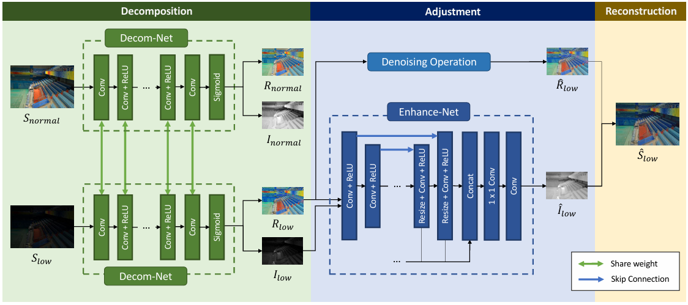

原文：Deep Retinex Decomposition for Low-Light Enhancement

本文是第一篇应用 Retinex 理论的NN方法，他的网络结构很有意思

# 网络结构

上图是本文的网络结构，主要分为3部分：
- 分解网络：学习如何拆分 反射$R$ 跟照明$I$
- 增强网络：学习 低光照明$I_{low}$ 到正常照明$I_{normal}$的映射
- 重建：执行$S=R*I$

## 分解网络

图中分解网络画了两个，实际他们权重一样的，因此是一个网络。没有真实光照图跟反射图，因此这里不能直接监督学习。这里通过设计 Loss 来让模型学习如何如何区分：
1. 重建损失：
    1. 自身重建：$S_{low}=R_{low}*I_{low}$(normal 同理，此处省略)。loss权重 1
    2. 交叉重建：$S_{low}=R_{normal}*I_{low}$,利用配对数据的 $R_{low}=R_{normal}$ 先验。loss 权重 0.001，避免网络乱学（本身配对数据也做不到完美一致）
2. 不变反射损失：$L_{ir}=||R_{low}-R_{normal}||$
3. 结构感知平滑损失:
    1. 这里是光照平滑假设，但是在梯度变化区域（物体边缘）不能太平滑，否则会出现光晕
    2. loss 公式如下：$$L_{is}=\sum_{i=low,normal}||\nabla I_i\circ exp(-\lambda_g \nabla R_i)||$$其中$\nabla$是计算水平、竖直两个方向的梯度。
    3. 在平滑区域，$R_i$ 梯度接近0,对应exp部分接近1，即平滑惩罚生效
    4. 在纹理、边缘区域。$R_i$ 梯度很大，exp 部分接近0，此时平滑惩罚关闭

## 增强网络

这里也没有给重建网络GT，而是让重建网络学习$I_{low}$到$I_{normal}$的映射。其loss包括：
- 重建损失：$||R_{low}\circ \hat{I}-S_{normal}||$
- 平滑损失：参考分解网络的平滑损失
​
另外 $R_{low}$ 被拉亮时，噪声也会被拉起来，因此这里用了BM3D降噪（图中 Denoising Operation）。

## 重建

这里直接: $\hat{S}_{low} = \hat{R}_{low}\circ\hat{I}_low$

# 训练

训练分为三个阶段：
1. 训练分解网络
2. 冻结分解网络，训练增强网络
3. 端到端微调，小学习率

# 局限

1. 对配对数据(低光, 正常光)的强依赖，防止抖动
2. 分解隐式实现的，不是真实的物理折射率与光照。极端光影下，分解结果会不自然
3. 噪声处理没有用网络
4. 平滑loss 仍会引入光晕伪影（在明暗交界处，如窗口。虽然已经采取了一些措施）
